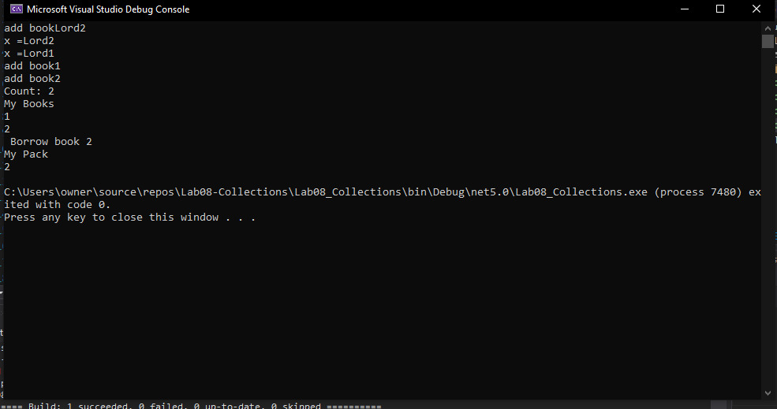

# Lab08-Collections

# Y&M Library
## In this lab we created our own Lending Library filled with Books, and a Backpack to hold borrowed Books.

## Project mechanism:
> 1- We create a *Book* class to hold appropriate properties.

> 2- Since books need to be borrowed by Title, we used *a private Dictionary<string, Book>* for storage.

> 3- We have provided a detailed explanation of the project in this [video](https://drive.google.com/file/d/10pasAujyGceRoEha0NeYRYt7dX6111LE/view?usp=sharing), you can watch it for more details.

**Output example**:

**Test window**:

